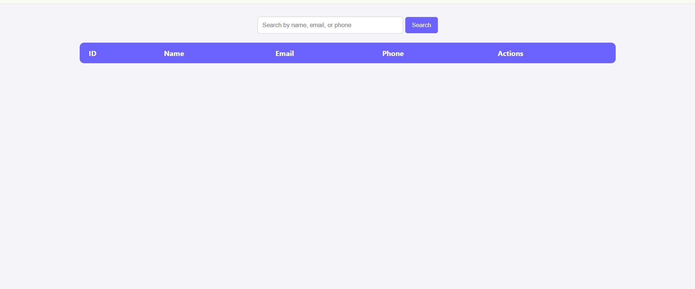

# Task 3 – Advanced Features Implementation

## 📘 Internship Project – ApexPlanet Software Pvt Ltd

### 🧩 Overview
This task involved enhancing the existing **Basic CRUD Application.** by implementing new functionalities and improving user experience. The primary focus was on adding **search and pagination** features and refining the **user interface** for better usability and design consistency.

### 🚀 Features Implemented
- 🔍 **Search Functionality:** Allows users to quickly find students based on names or IDs.  
- 📄 **Pagination:** Efficiently displays records with page navigation for improved performance.  
- 🎨 **Improved UI Design:** Enhanced layout and styling for a clean, modern look.  
- ⚙️ **Optimized Queries:** Ensured faster data retrieval and smooth interaction.

### 🛠️ Technologies Used
- **Frontend:** HTML, CSS, Bootstrap  
- **Backend:** PHP  
- **Database:** MySQL  

### 💻 How to Run the Project
1. Install and start **XAMPP** or **WAMP** server.  
2. Copy the project folder to the `htdocs` directory.  
3. Import the provided `.sql` file into **phpMyAdmin**.  
4. Open your browser and navigate to:  
http://localhost/TASK-3/

### 📸 Screenshots
## 📸 Screenshots

